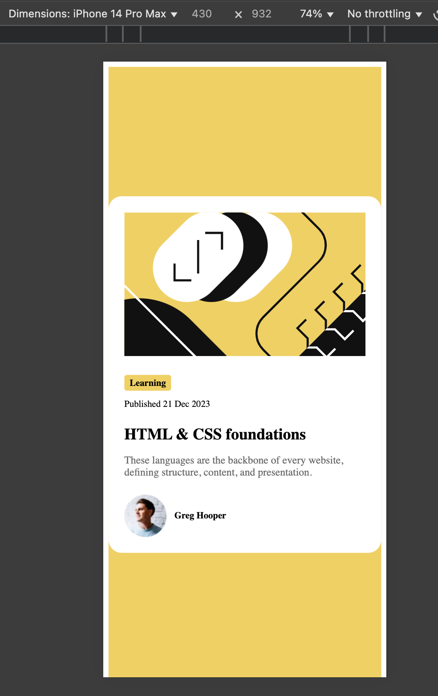

# Blog preview card


## 🚀 Overview

- This is a solution to the **Blog preview card**.
- The goal was to build a simple and responsive Blog preview card using **HTML** 
and **CSS**, based on the provided design.

## 🛠️ Built With

- Semantic HTML5
- CSS3 custom properties
- Flexbox for layout
- Responsive design principles

## 📸 Screenshot

| Desktop view | Mobile view |
|--------------|-------------|
|  |  |

## 🧠 What I Learned

While building this project, I reinforced key front-end development concepts such as:

- Structuring clean and semantic HTML
- Creating a centered card layout using `flexbox`
- Using design tokens like variables for colors and fonts
- Building a responsive UI that looks good on both desktop and mobile

## 📁 Folder Structure

BLOG-PREVIEW-CARD/
├── assets/                    # Static assets like fonts and images
│   ├── fonts/                # Custom or third-party fonts
│   └── images/              # Image files used in the project
│       ├── desktop-design.png
│       ├── favicon-32x32.png
│       ├── illustration-article.svg
│       ├── image-avatar.webp
│       └── mobile-design.png
├── design/                    # Design reference images
│   ├── active-states.jpg
│   ├── desktop-design.jpg
│   └── mobile-design.jpg
├── .gitignore                 # Git ignore rules
├── index.html                 # Main HTML file
├── preview.jpg                # Project preview screenshot
├── README.md                  # Project documentation
└── style-guide.md             # Style guide provided with the project


## 🚀 Getting Started

To view this project locally:

1. Clone this repository:
   ```bash
   git clone https://github.com/karina-krupodior/BlogPreviewCard.git
   ```
2. Navigate to the project folder:
   ```bash
   cd blog-preview-card-main
   ```
3. Open `index.html` in your browser.

## 🌐 Live Demo

Check out the live site here: https://karina-krupodior.github.io/BlogPreviewCard/

## ✍️ Author

- GitHub: https://github.com/karina-krupodior
